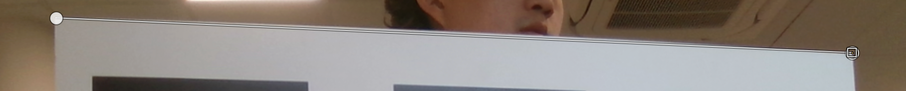
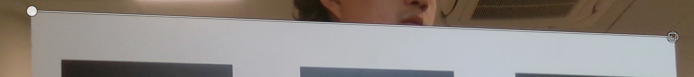
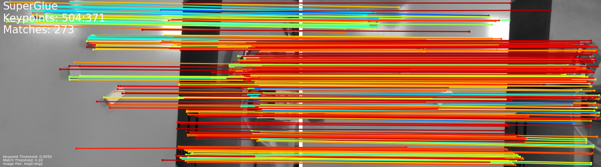

# Cezary Botta - Stitching

Version of Python used: 3.11.4

Code can be run by running ```python stitch.py``` in the terminal. The main function showcases each task one after the other.
(other than Task 4). The folders calibration and stitching should be in the working directory, and for Task 7 - the cloned SuperGlue repository.

### Task 1
The reprojection error was unusually smaller when considering each tag separatly, however, as expected, in practice the undistorted images were better if all tags where considered at once (as we have more information to work with). Here is an example of a straight line in an image undistorted in both cases (the first calibration image, I used it for this example because it has a long straight line that was originally quite distorted):

##### Separate tags:


##### All tags:



### Task 2
The transform_image function has been equipped with additional parameters and return values to help in later tasks.
Provide img_to_pad=None, display=True to get the standard result. The function will automatically pad the original image with
transparent pixels to make sure it has the same dimensions as the final image. If you want to provide your own image to pad, you can do so by providing the img_to_pad parameter. If you don't want to display the image, you can set display=False. The
function will return the transformed image, the padded image, and the position of the new origin after padding wrt the original origin.


### Task 3
There isn't anything special to note about this task. The tests are run by the main function.


### Task 4
The pairs of matching points are stored in the PAIRS variable.


### Task 5
There isn't anything special to note about this task. The main function stiches img1.png and img2.png together.


### Task 6
We again stich img1.png and img2.png together. Here is the SuperGlue visualization:


The matching pairs are stored in img1_img2_matches.npz.


### Task 7
We stitch img1.png - img5.png together. To run the code, you need to have the SuperGlue repository cloned in the working directory.